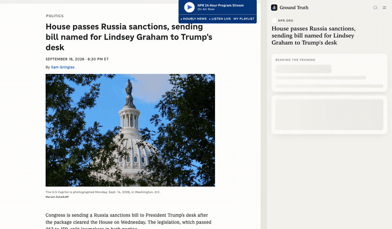
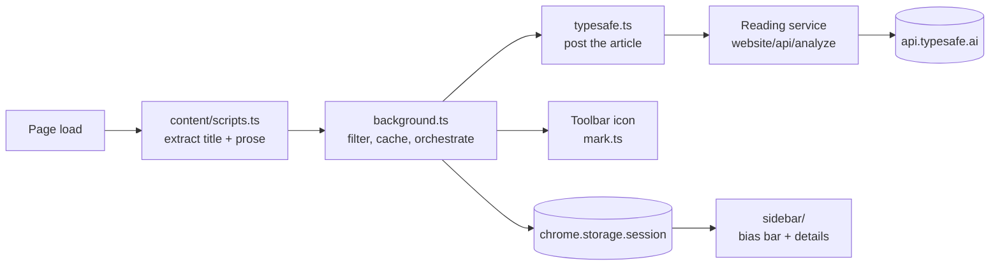

<div align="center">

# Ground Truth

Ground News style bias check for the article in your current tab.

[](LICENSE)
[](https://github.com/jagenaujagenau/ground-truth/stargazers)
[](tsconfig.json)
[](https://docs.typesafe.ai)

<br>



<sub>Real run against a live NPR article — the judgments come from TypeSafe, not a mockup. <a href="docs/demo.mp4">Higher-quality MP4</a></sub>

</div>

## What is this?

A browser extension that rates the political lean of whatever article you are reading. Every page you load is checked automatically: the toolbar icon becomes a Left / Center / Right stripe with an `L`, `C`, `R` or `MIX` badge, and the side panel shows the bias bar, piece type (news / analysis / opinion), topic, and how loaded the language is.

All five judgments come from a single TypeSafe [`jev-latest`](https://docs.typesafe.ai) call. The extension doesn't make that call itself: it posts the article to a reading service — the one in [`website/`](website/), which holds the TypeSafe key — and gets the judgment back. So no key ships in the build, and the extension asks for no host permissions at all. Pages with under 800 characters of paragraph text are skipped before anything is sent, and results are cached per URL for the session. Built with [Extension.js](https://extension.js.org); builds for Chromium, Firefox and Edge.

## Quick Start

```sh
cp .env.example .env   # set EXTENSION_PUBLIC_API_URL, e.g. https://groundtruth.click/api/analyze
npm install
npm run dev            # Chromium with the extension loaded
```

The project runs one at `https://groundtruth.click/api/analyze`, which is what the published builds
point at. To run your own, the site in [`website/`](website/) is that service.

```sh
npm run build          # dist/chromium; build:firefox and build:edge also available
node src/typesafe.test.ts && node src/domains.test.ts && node src/i18n.test.ts
```

The `.env` address is bundled into the build. Leave it empty and the panel asks for one instead, under **Settings → Reading service**; it is stored in `chrome.storage.local`. Either way the TypeSafe key lives on the service, never in the extension.

To limit checks to specific sites, list their domains under **Settings → Sites** in the panel. Subdomains are included; an empty list means every site.

## Languages

The panel speaks English, Spanish, German, French, Italian and Portuguese, and follows your browser's language on its own — there is no setting. The Spanish is Rioplatense (voseo: *agregá*, *pegá*, *elegís*) and the Portuguese is European; each catalog is written as that language would put it, not translated line by line from the English. Every string lives in [`_locales/<lang>/messages.json`](_locales); `src/i18n.test.ts` fails the build if a catalog drifts from `en`, if a key the code asks for is missing, or if a string is defined and never used. The website ships the same catalogs, so the panel reads identically in both.

## How it works



The background worker never reads tab URLs — the extension asks for no `tabs` permission, so pages without a content script simply land in the `empty` state.

## Project Structure

```
src/
├── content/
│   └── scripts.ts        # extracts the article's title and paragraph text
├── images/               # toolbar and store icons (16–128px)
├── sidebar/
│   ├── index.html
│   ├── scripts.ts        # renders the bias bar, details and Settings
│   └── styles.css
├── background.ts         # per-tab check loop, caching, icon painting
├── domains.ts            # Sites list parsing and matching
├── domains.test.ts
├── manifest.json         # Chromium / Firefox manifest with per-browser keys
├── mark.ts               # canvas brand mark, drawn from the lean shares
├── shared.ts             # TabState, storage keys, service address resolution
├── typesafe.ts           # posts the article to the reading service
└── typesafe.test.ts
_locales/                 # en, es, de, fr, it, pt message catalogs
extension.config.js
package.json
STORE.md
tsconfig.json
```

## Documentation

| Resource | Description |
|----------|-------------|
| [`src/typesafe.ts`](src/typesafe.ts) | The call to the reading service, and how lean levels collapse into Left / Center / Right shares |
| [`website/src/lib/typesafe.ts`](website/src/lib/typesafe.ts) | The five questions sent to `jev-latest`, on the service side |
| [`website/README.md`](website/README.md) | The site, and the service the extension talks to |
| [`src/background.ts`](src/background.ts) | The per-tab check loop: extraction, filtering, caching, icon painting |
| [`src/manifest.json`](src/manifest.json) | Permissions and per-browser manifest keys |
| [`_locales/`](_locales) | The six message catalogs; `default_locale` is `en` |
| [`CHANGELOG.md`](CHANGELOG.md) | What changed in each version; releases are tagged `v<version>` |
| [`STORE.md`](STORE.md) | Store listing copy, permission justifications and reviewer notes |
| [TypeSafe docs](https://docs.typesafe.ai) | The System One API behind the judgments |
| [Extension.js docs](https://extension.js.org) | Build tooling and browser targets |

## Contributing

Issues and pull requests are welcome. Run both test files before opening a PR — they are plain `node` scripts with no test runner.

<a href="https://github.com/jagenaujagenau/ground-truth/graphs/contributors">
  
</a>

## License

MIT — see [LICENSE](LICENSE).

---

<div align="center">

[](https://star-history.com/#jagenaujagenau/ground-truth&Date)

</div>
